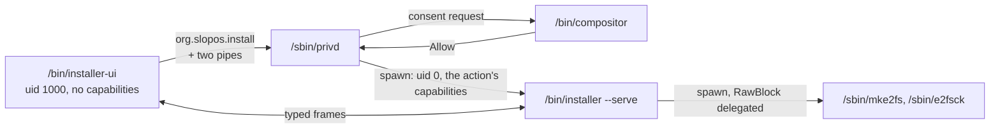

# A Graphical Installer

## Goal

Let a person install SlopOS from the live medium through a window, with the
same engine, the same guarantees and the same tests as the CLI. When this plan
is done:

- **Welcome window.** A live boot opens a *Welcome* window with two choices,
  *Try SlopOS* and *Install SlopOS*. The dock carries an *Install SlopOS* entry
  while the system runs from a medium.
- **Wizard.** `/bin/installer-ui` walks a linear wizard: Disk → How → Review →
  Install → Done or Error. Back keeps every answer. It runs as the session user
  and holds no capability.
- **Engine.** The UI never touches a disk. It asks privd for
  `org.slopos.install`, the compositor asks the person for consent, and privd
  runs `/bin/installer --serve` with the install capabilities on the UI's pipes.
  The two then speak a typed frame protocol.
- **Proposals.** The engine computes every proposal: the before and after
  partition bars, the action list, and the issues that block a choice. It
  checks again at Install that the disk is still the one reviewed.
- **Root size.** The root's size is a choice in erase and free-space installs.
  The CLI gains `--root-size`.
- **CLI.** The CLI stays as it is: the same engine with a human renderer, the
  same questions, flags and output lines.

## Depends on

`plans/access-model.md`, completely. This plan uses:
- the session uid;
- privd, its action policy and `slopos_userland::privd::elevate`;
- compositor consent;
- `RawBlock` delegation to e2fsprogs;
- `DacOverride` for the new root's ownership map.

It starts once that plan's last phase lands.

## Where it stands

**The CLI.**
- `/bin/installer` is `userland/src/apps/installer/`: `mod.rs` (884 lines),
  `disk.rs` (517), `root.rs` (461) and `boot.rs` (224). It shares
  `userland/src/boot_disk.rs` with `bootctl` and the tests. Only
  `installer_main` and `Medium` are public (`mod.rs:18-20,51,878`).
- The flow runs `Medium::find` (`mod.rs:94-149`), then `settle` (`mod.rs:471-617`),
  which asks for:
  - the disk;
  - the mode: erase, free or reuse, forced to erase on a disk without a
    readable GPT;
  - the root partition;
  - the free region;
  - whether to keep the root;
  - the `/src` remote;
  - whether SlopOS goes first in `BootOrder`.
- After `settle` it prints a summary and asks for a typed confirmation: the
  disk's name to erase, `yes` otherwise (`mod.rs:688-758`).
- `install` then runs nine steps (`mod.rs:791-869`):
  1. writing the partition table
  2. re-reading it
  3. formatting the new partitions
  4. filling the root
  5. writing both slots
  6. writing the loader and its configuration
  7. making slot a the default
  8. checking the root
  9. registering the firmware entry
- Every question has a flag (`mod.rs:204-262`).

**Planning is pure; the rest is not.**
- `boot-core::install::{plan, regions, Plan, PlanError}` is `no_std` and
  host-tested (`boot-core/src/install.rs:266-369`). The root always takes the
  rest of the region (`install.rs:344-352`).
- The app's `Settled` is private and its errors are `String`.
- The questions are interleaved with I/O: disk reads, a `BLKRRPART`, ESP
  probes, the EFI-variable reads for the Limine menu.
- Progress is `println!("installer: [n/9] …")`. The toolchain and `/src`
  copies print a line every 256 MiB with no total (`root.rs:28-29,225-238`).
- `mke2fs` and `e2fsck` inherit stdio and are judged by exit code
  (`disk.rs:470-517`).
- Nothing is machine-readable.

**Failure is re-runnable, not rolled back.** An interrupted erase leaves a
disk that only erase installs onto (`disk.rs:248-266`). A half-made ESP or
boot partition is detected and reformatted (`disk.rs:375-403`). tree-core
writes an `UNFINISHED` manifest before it copies, `/src` is staged and
renamed, and the firmware entry comes last.

**Tests.**
- `installer_test` types the blank disk's answers into `/bin/shell -c
  "installer …"`, and gives the foreign, reuse and reinstall disks flags
  (`userland/src/bin/tests/installer_test.rs:223-385`).
- `just test-installer` greps the installer's own lines.
- The host then holds every table, volume and foreign byte to what it must be.

**The live desktop.**
- init starts the compositor and then the terminal; nothing knows it is live
  (`userland/src/apps/init_process.rs:90-170`).
- The dock pins five programs (`userland/src/apps/compositor/dock.rs:135-177`).

**appkit is Elm-shaped and close to enough.**
- An app implements `App { view, update, tick, on_key, on_close_request }`
  and calls `run_app` (`appkit/src/node.rs:311-366`).
- It has these widgets: Label, Button (Primary, Secondary, Destructive),
  Checkbox, LineEdit, ProgressBar, ListView, Table, ScrollView, TabBar, and a
  Dialog whose actions take no focus until Tab or an arrow.
- It lacks a radio group, a slider, a partition bar and indeterminate progress.
  `Node::Canvas` is an empty label (`appkit/src/tree.rs:463-471`).
- The loop waits only on the compositor, a wake pipe and a timer, so a pipe's
  frames cannot reach `update` (`appkit/src/run.rs:250-300`).
- ProgressBar's default fill is a load meter that turns yellow and red
  (`progress_bar.rs:35-45`).
- The theme is dark only, the scale is 1, and a client cannot ask for
  fullscreen (`slop-protocol/src/types.rs:118-262`).

## What the prior art settles

| Source | What it shows | Taken here |
|---|---|---|
| Fedora Anaconda WebUI ([redesign](https://fedoramagazine.org/anaconda-installer-redesign/), [ReviewConfiguration.jsx](https://github.com/rhinstaller/anaconda-webui/blob/main/src/components/review/ReviewConfiguration.jsx)) | Dropped hub-and-spoke because it "can feel like jumping around". Pick what you want to achieve, not how. A review page with a scenario-labelled install button that stays disabled until a checkbox whose wording scales with the damage is ticked. "Reinstall" is shown only when an install is detected. | linear wizard, task tiles, the review checkbox and button, reinstall only when found |
| Ubuntu ([installer steps](https://github.com/canonical/ubuntu-desktop-provision/blob/main/apps/ubuntu_bootstrap/lib/app/installation_step.dart), [design notes](https://canonical.com/blog/how-we-designed-the-new-ubuntu-desktop-installer), [Subiquity DESIGN.md](https://github.com/canonical/subiquity/blob/main/DESIGN.md)) | A Try-or-Install landing. A separate confirm screen whose partition rows read Erased / Unchanged / Resized. A size slider paired with a numeric box. The window cannot be closed while installing. A privileged engine computes storage and the UI only renders it, with nothing written before confirm. | welcome window, action list with tags, slider plus box, close refused, engine-owned proposals |
| Calamares ([ChoicePage.cpp](https://codeberg.org/Calamares/calamares/src/branch/calamares/src/modules/partition/gui/ChoicePage.cpp)) | "Current:" and "After:" bars. | the Now and After bars |
| elementary ([Drive Selection](https://github.com/elementary/installer/wiki/Drive-Selection), [Progress](https://github.com/elementary/installer/wiki/Progress)) | The boot drive and too-small drives are shown but disabled and sorted last; Calamares hides them silently and earns a "my disk isn't visible" FAQ. Progress has no back or forward. | unofferable disks shown disabled with their reason, no cancel after confirm |
| Agama ([agama#1770](https://github.com/agama-project/agama/issues/1770), [HTTP API](https://github.com/agama-project/agama/blob/master/doc/http_api.md)) | Hub users lose their place. Every config change recomputes the proposal at once. | no hub; every choice re-proposes |
| Redox ([installer](https://gitlab.redox-os.org/redox-os/installer), [the book](https://doc.redox-os.org/book/installing.html)) | Its GUI shows "Installation progress is in terminal" because the library prints instead of emitting events. TUI and GUI copy the pipeline, and the copy ends a failed clone on the success page. It has no review page and no mounted-disk guard, and its CI never boots an installed image. | an engine that emits events and never prints; one pipeline; review page; the QEMU install tests kept |
| Asterinas ([distro README](https://github.com/asterinas/asterinas/blob/ec5bb9ed798851b4c1854e791341321902ac8bc9/book/src/distro/README.md)) | No installer UI: a NixOS ISO, a root shell and a script. Its CI does install end to end in QEMU. | nothing to borrow for the UI; confirms end-to-end install grading |

## Design

### Processes



- **The request.** The UI makes two pipes and asks privd for
  `org.slopos.install` with argv `--serve`, handing over the engine's ends as
  stdin and stdout. Consent is asked once, when the person presses *Install
  SlopOS*, because even reading the disks' partition tables takes `RawBlock`.
- **The action.** From the access plan's policy:

  ```
  action org.slopos.install
    program  /bin/installer
    args     *
    caps     RawBlock Mount Power BootEntry Seal DacOverride
    uid      0
    allow    session consent
    exclusive
  ```

- **If the UI dies.** The engine notices end-of-file and exits before an
  `Install` frame without writing anything. After one, it runs to the end,
  because the steps are not interrupted. It writes its log into the new root.
- **The CLI.** `installer` typed in a terminal elevates itself through the
  same action with its own argv and the terminal as stdio, and asks its
  questions there.

### The engine

`userland/src/apps/installer/` splits into an engine and two renderers. The
disk, root and boot code stays where it is.

- **`engine`.** It has three operations:
  - `probe() -> System`: the medium and its payload, every whole disk with
    its layout or why it is not offered, existing SlopOS roots, and the other
    systems in `BootOrder`.
  - `propose(&System, &Choices) -> Result<Proposal, Vec<Issue>>`: pure over
    the probed state, through `boot-core::install::plan`.
  - `install(&Choices, &Proposal, &mut dyn Events) -> Result<Summary, Failure>`:
    it re-probes the chosen disk and re-plans first. A result that differs
    from the reviewed proposal is `Failure` ("the disk changed since review")
    with nothing written.

  `Settled` becomes the engine's internal state. `String` errors become
  `Issue` and `Failure { step, message }`, rendered to the CLI's present
  wording.
- **`cli`.** Today's questions, flags, summary and typed confirmation are a
  renderer over `System`, `Proposal` and `Events`. It prints the lines
  `just test-installer` greps, unchanged.
- **`serve`.** `installer --serve` speaks the protocol on stdin and stdout. It
  refuses to start unless `PRIV_ACTION` is `org.slopos.install`.
- **Progress with totals.** Before copying, the engine sums `Item::size` over
  the tree-core plan (`tree-core/src/lib.rs:65-67`) for the toolchain, and the
  file sizes of the `/src` seed. Each copy then emits `Progress{done, total}`
  as it goes.
- **e2fsprogs output.** It is piped and forwarded as `Log` lines instead of
  inheriting stdio. The children get `RawBlock` delegated.
- **The log.** Every event is kept in memory and written to
  `/var/log/installer.log` on the new root once that root is mounted, so a
  failure after step 4 leaves its log behind.

### `installer-core`

A new crate, `no_std` with `alloc`, `forbid(unsafe_code)`, host-tested under
`just test-host`. It holds everything both sides agree on:

- **`Choices`**:
  - the disk;
  - the mode: `Erase`, `Free{region}`, `Reuse{root, keep}`;
  - an optional root size;
  - the `/src` remote;
  - whether SlopOS goes first in `BootOrder`.
- **`System`**: the medium (payload size, whether it carries `/src`) and its
  disks. Each disk has a node, capacity, block size, an offered-or-why, a
  layout of partitions and free runs with type names, and an existing SlopOS
  root. It also carries the other boot entries.
- **`Proposal`**:
  - an id;
  - the `before` and `after` layouts;
  - actions tagged `Erase`, `New`, `Format`, `Share`, `Keep` or `Reuse`;
  - the root's minimum, maximum and chosen size;
  - the systems the Limine menu will carry, and those it leaves out.

  It is built by a pure function from a `boot-core` plan and the table it was
  planned on.
- **`Issue`**: `PlanError` and the medium's and disks' refusals, in the CLI's
  wording.
- **`Event`**: `Step{index, total, title}`, `Progress{done, total}`,
  `Log{line}`, `Done{summary}`, `Failed{step, message}`.
- **The protocol and its codec** (below).
- **`Wizard`**: the page state machine. It decides which page is reachable,
  when the primary button is enabled, and what Back restores. A page is never
  derived from widget state.

### Protocol

- **UI to engine:**
  - `Hello{version}`
  - `Probe`
  - `Propose{choices}`
  - `Install{choices, proposal_id}`
- **Engine to UI:**
  - `Hello{version}`
  - `System`
  - `Proposal` or `Issues`
  - a stream of `Event`s, then `Done` or `Failed`
- **Framing.** Frames are `remote-core`'s: a kind byte, a big-endian length,
  and a `Fields` payload (`remote-core/src/lib.rs:93-156`). The tree already
  has that framing and its mutation tests, and userland has no serde. The
  engine exits after `Done`, after `Failed`, or at end-of-file.
- **No cancel message.** Nothing after `Install` can be cancelled.

### The window

`/bin/installer-ui` is an appkit app with app id `org.slopos.installer` and a
900 × 640 window. That fits 1280 × 720, and there is no fullscreen request to
ask for a bigger one. The window has a header with the step strip (*Disk · How
· Review · Install*), the page, and a footer with Back and the page's primary
button. Everything is reachable with Tab, Enter activates, and Escape is Back
on every page but Install.

1. **Welcome.** *Try SlopOS* closes the window; *Install SlopOS* asks privd,
   then probes.
   - A medium with no payload says so, with the CLI's wording ("the medium
     carries no toolchain").
   - A refused or expired consent leaves the person here, with the reason.
2. **Disk.** Offered disks come first. Each row shows the node, the capacity,
   and what the disk holds: "blank", "GPT: EFI system, Windows (basic data),
   120 GiB free", or "an MBR partition table with 2 partitions".
   - Disks the engine will not offer (the medium, write-protected) are shown
     disabled and sorted last, with the reason.
   - A *Rescan* button sits below the list.
3. **How.** Task tiles in a radio group:
   - *Erase disk and install*.
   - *Install beside what is there*: free space. It is disabled with the
     planner's reason when no region fits. A region picker appears when two or
     more fit, defaulting to the largest.
   - *Use a partition as the root*: a partition list.
   - *Reinstall SlopOS*: shown only when a SlopOS root is found. It reuses that
     root, keeping it.

   A disk without a readable GPT offers erase alone and says why. Under the
   tiles sit a *Now* bar, an *After* bar and, for erase and free, the root size
   slider with a numeric box. *Options* holds the `/src` remote (when the
   payload has `/src`) and "Put SlopOS first in the firmware boot order", which
   is off by default. Every change sends `Propose`, and the bars and the
   button follow the reply.
4. **Review.**
   - A summary: disk, mode, root size, toolchain, the `/src` remote, boot
     order.
   - The action list with its tags.
   - The other systems the boot menu will offer, and any it leaves out.
   - A checkbox whose text follows the mode:
     - erase: "I understand that everything on nvme0n1 will be erased";
     - free: "I understand that new partitions will be created in free space
       on nvme0n1, and nothing else on it changes";
     - reuse: "I understand that nvme0n1p3 will be formatted".
   - The Destructive primary button stays disabled until the box is ticked. It
     is labelled by scenario: *Erase nvme0n1 and install*, *Install beside
     Windows Boot Manager*, *Format nvme0n1p3 and install*, *Reinstall SlopOS*.
5. **Install.** The nine steps as a list, each pending, running or done, with
   the current step's detail line.
   - A ProgressBar in a fixed colour shows bytes over the total during the
     copies. An indeterminate bar shows otherwise.
   - *Show log* opens a scroll view of the `Log` lines.
   - `on_close_request` refuses while the engine runs. There is no cancel.
6. **Done.** "SlopOS is installed on nvme0n1", the remove-the-medium note, and
   the no-toolchain note when it applies. *Restart now* asks privd for
   `org.slopos.power.reboot`; *Keep using the live system* closes.

   **Error.** The failed step, its message and the log. *Back to review*
   offers the same choices again, which the re-runnable design makes safe, and
   *Restart* is beside it.

The How page, erasing a 512 GiB disk:

```
 How should SlopOS be installed on nvme0n1?
 ( ) Install beside what is there   — no free region holds 7.0 GiB
 (•) Erase disk and install
 ( ) Use a partition as the root
     Now   [ EFI |      Windows 380 GiB        | data 130 GiB ]
     After [E|B|            SlopOS root 200 GiB    |C|  free 310 GiB ]
     Root size  ──────●──────────────  [ 200 GiB ]   7.0 GiB – 510 GiB
                                                  [ Back ]  [ Review ]
```

### appkit additions

Each addition is general, tested in `appkit_test` like the existing widgets,
and shown in `widget_gallery`:

- **`RadioGroup`.** Arrows move the selection and Space picks. The group takes
  one tab stop.
- **`Slider`.** Horizontal, with minimum, maximum and step. Arrows,
  PageUp/PageDown and Home/End work. The app pairs it with a `LineEdit` for
  exact entry.
- **`PartitionBar`.** Proportional segments with a label, a colour or a
  free-space hatch, and a highlighted segment, painted through `PaintContext`.
  It is a dedicated widget rather than a general canvas, because nothing else
  needs one.
- **Indeterminate progress.** ProgressBar with no value, animated on the
  app's tick.
- **Messages from a thread.** `run_app` gives the app a `Send` handle that
  posts an app message and wakes the loop. `UiSender` already wakes the loop;
  it gains the message. The UI's reader thread decodes frames and posts them.

### Where it starts

- **Live boot.** On a live boot (`/media/install` is a basefs, `boot-core`'s
  `layout::MEDIUM_DIR`), init spawns `/bin/installer-ui --welcome` as the
  session user once the compositor's readiness gate opens.
- **Dock.** The compositor pins *Install SlopOS* only when `/media/install` is
  a medium, and matches the window by app id.
- **Terminal.** `installer` remains the CLI.

`installer-ui` joins `BASE_PROGRAMS` (`scripts/lib/base.sh:6`). It ships in
every base and, like the engine, refuses without a medium.

### Root size

- **The planner.** `boot-core::install::plan` takes a root size, a minimum
  and an optional target. The root is the target clamped between the minimum
  and the rest of the region. The crash partition follows it, and what remains
  stays free.
- **The minimum** is `root_min`: 1 GiB, or the payload plus 6 GiB.
- **The CLI** gains `--root-size <size>`, given as a flag only, so its
  questions and the tests' typed answers are unchanged.
- **The UI.** `installer-core` derives the slider's range from the proposal.

## Phases

Five phases. Each ends with something that runs, and each lands as commits of
its own.

### Phase 1: An engine that emits events

Split `apps/installer` into `engine` and `cli`:
- typed `Issue` and `Failure`;
- `Event`s with copy totals;
- piped e2fsprogs output;
- the install log on the new root;
- the re-probe and re-plan at install.

The CLI renders exactly what it prints today.

Ends with: `just test-installer` green on all its disks with the same markers,
and an installed root holding `/var/log/installer.log`.

### Phase 2: `installer-core` and `--serve`

Build the crate: `Choices`, `System`, `Proposal`, `Issue`, `Event`, the
protocol, the codec and the `Wizard`. Add `installer --serve`, the root size
in `boot-core`, and `--root-size`.

Ends with:
- host tests green;
- `installer_test` installing its reuse disk through privd and `--serve` with
  a scripted protocol client, which asks as `root`, so no consent is needed;
- the foreign disk installed with `--root-size` and the host holding the free
  space after the crash partition.

### Phase 3: appkit widgets

Build `RadioGroup`, `Slider`, `PartitionBar`, indeterminate progress, and
message posting from a thread.

Ends with: `appkit_test` cases for each widget's layout, focus and keys, and
`widget_gallery` showing them.

### Phase 4: The window

Build `/bin/installer-ui`'s pages over the protocol. Add `installer_ui_test`,
in `editor_test`'s style: it drives the app with scripted engine frames and
holds the page sequence, Back restoring choices, the primary button's
enablement, the checkbox and button wording per mode, and the frames the app
sends.

Ends with: the test green, and a manual run on `just boot-live` with a blank
disk, recorded in the commit message, as the visual acceptance.

### Phase 5: Where it starts

Add init's welcome on a live boot and the dock entry on a medium.

Ends with: `just iso` booting to the Welcome window, and the dock entry
absent on `just boot`.

## Grading

- **Host:**
  - `installer-core`: codec round trips with mutation loops as `remote-core`
    has; proposals from `boot-core` plans for erase, free, reuse and
    reinstall, MBR and blank disks, and root sizes at and past both bounds;
    the wizard's transitions and enablement.
  - `boot-core`'s plan tests gain the root size.
- **In the guest:** `installer_ui_test` and the new `appkit_test` cases.
- **End to end:** `just test-installer` keeps every lane it has. The blank disk
  stays typed into the CLI, and the reuse disk moves to the protocol through
  privd. The host-side checks do not change.
- **Not graded by machine:** the window's pixels. It is a program that has to
  work once and keep its contract, and the model and protocol tests hold the
  contract. There is no QMP-driven GUI harness and no screenshot goldens.

## Out of scope

- Manual partitioning, and shrinking another system's filesystem: *beside*
  means free space.
- Disk encryption, which SlopOS does not have.
- Pages for network, locale, time zone, keyboard or a user name. The session
  user is `user`, from the access plan.
- Cancel after confirm, an installer self-update, telemetry, and a slideshow.
- HiDPI, a light theme, a client fullscreen request, translations (the font
  set has no CJK), and screen-reader output (appkit's roles exist, but nothing
  reads them).
- Installing from a boot that is not the medium's: the engine refuses, as it
  does today.

## Decided

- **A linear wizard with a review page.** Fedora's and Ubuntu's shape. A hub
  suits long flows, and its users lose their place.
- **A welcome window on a live boot and a dock entry on a medium only.** The
  installed system's desktop does not change.
- **Fedora's guard, not a typed name.** A checkbox whose wording follows the
  damage, and a Destructive button labelled by scenario. The CLI keeps its
  typed confirmation, and none of the surveyed installers types one.
- **The engine owns planning.** The UI renders proposals and never computes a
  layout, and the engine checks the disk again before writing.
- **The engine runs under privd as uid 0 with the install capabilities; the UI
  holds nothing.** Consent is asked once, at *Install SlopOS*.
- **Before and after bars plus a tagged action list.** The bars show the
  shape, and the list carries it for the keyboard and for anyone who cannot
  read colours.
- **Root size is the one choice beyond the CLI's.**
- **`remote-core`'s framing on privd-supplied pipes.** No JSON, because there
  is no serde in userland, and no socket, because the pipes are what privd
  hands over.
- **No cancel after Install.** The window refuses to close while installing,
  and a UI that dies does not stop the engine.
- **Graded by model, protocol and the existing QEMU installs.** No GUI harness.

## Constraints

- Everything the installer paragraph in `AGENTS.md` states still holds. The
  installer writes nothing outside the partitions it made or was given, nor
  anything on a shared ESP outside `\EFI\SlopOS\`, and the firmware entry
  comes last.
- The CLI's output lines are a test interface. A change to one changes
  `just test-installer` in the same commit.
- `installer-core` adds no dependency outside the tree, so it needs no
  `NOTICE.md` entry.
- `AGENTS.md`'s installer paragraph and `plans/README.md` move with each
  phase.
